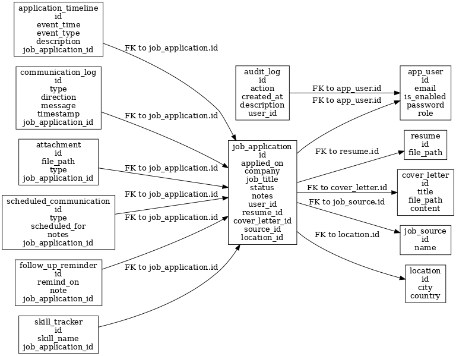

# 📦 Models

This directory contains the core JPA entities used in the **JobTrackr** application.  
Each entity maps to a relational database table and represents essential concepts in job tracking, user management, and audit logging.

---

## 🗂 Entities

* [`ApplicationTimeline.java`](./ApplicationTimeline.java)  
  Logs significant events (`CREATED`, `UPDATED`, `SUBMITTED`, `CANCELLED`) in a job application's lifecycle.

* [`Attachment.java`](./Attachment.java)  
  Stores files related to job applications, such as job descriptions, offer letters, or interview prep materials.

* [`AuditLog.java`](./AuditLog.java)  
  Tracks user actions (e.g., `CREATE`, `UPDATE`, `DELETE`) across the system for accountability and auditing.

* [`CommunicationLog.java`](./CommunicationLog.java)  
  Records communication activity tied to a job application, such as emails, calls, or LinkedIn messages.

* [`CoverLetter.java`](./CoverLetter.java)  
  Represents user-written or uploaded cover letters used in job applications.

* [`FollowUpReminder.java`](./FollowUpReminder.java)  
  Represents reminders set by the user to follow up on job applications.

* [`JobApplication.java`](./JobApplication.java)  
  The core model representing a job application — includes status, company, title, notes, and links to resumes, cover letters, and more.

* [`JobSource.java`](./JobSource.java)  
  Represents the origin of the job opportunity (e.g., LinkedIn, Referral, Company Site).

* [`Location.java`](./Location.java)  
  Stores geographic metadata for a job listing (city and country).

* [`Resume.java`](./Resume.java)  
  Stores file paths to user-uploaded resumes.

* [`ScheduledCommunication.java`](./ScheduledCommunication.java)  
  Represents upcoming interactions like interviews, assessments, or calls tied to an application.

* [`SkillTracker.java`](./SkillTracker.java)  
  Maps relevant skills to job applications to track required qualifications or improvements.

* [`User.java`](./User.java)  
  Represents a JobTrackr user with fields like email, encrypted password, role, and activation status.

---

## 🧩 Enums

* [`Role.java`](./Role.java)  
  Enumerates user roles (e.g., `BASIC`).

* **Embedded Enums** (defined within their respective models):

  * `ApplicationTimeline.EventType`
  * `Attachment.Type`
  * `AuditLog.Action`
  * `CommunicationLog.Type`, `CommunicationLog.Direction`
  * `JobApplication.Status`
  * `ScheduledCommunication.Type`

---

## 🗺️ Database Schema Diagram

The following diagram shows how the entities relate to each other via foreign keys.

---

## 📄 Full Schema SQL Dump

The full PostgreSQL schema (generated with `pg_dump -s`) is available here:

📄 [`schema.sql`](./schema.sql)

---

## 🔍 Suggestions for Further Improvements

If you're maintaining this README with a focus on the database structure, consider adding:

- ✅ **Cardinality annotations** (e.g., `1 → *`, `* → 1`) next to each relationship in the diagram or legend
- ✅ **Descriptions of relationships** (e.g., "`JobApplication` has many `Attachments`")
- ✅ **Glossary of Enums** with possible values (e.g., `Status: APPLIED | INTERVIEW | OFFER | REJECTED`)
- ✅ **ERD generation script** if the schema is auto-generated
- ✅ **How to regenerate schema.sql** instructions (e.g., `pg_dump` command)
- ✅ **Seeding or test data** references, if applicable

Let me know if you'd like to auto-document the schema with tools like [SchemaSpy](http://schemaspy.org/) or [JPA Buddy ERD generator].
